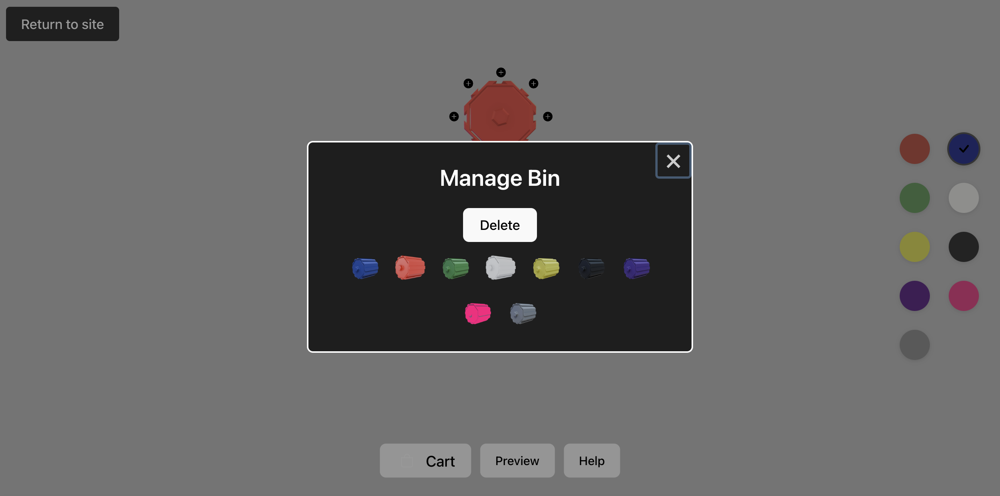

# Octobins_Simulator

🧩 Octobins Simulator
Welcome to the Octobins Simulator! 🎉 This is an interactive 3D simulator made for the e-commerce product "Octobins". It allows customers to create their own unique Octobin designs virtually, and then prompting them to purchase with the click of a button.

🔗 Live Demo: octobins.netlify.app

🛠️ Tools & Technologies
Three.js: For rendering 3D models and animations in the browser.
React: For building a dynamic and responsive user interface.
Blender: Used to slice STL files and generate 3D models for rendering.
OAuth: Implemented for secure authentication and API access

📸 Screenshots \n
Design Interface: A beautiful and interactive 3D interface where users can rotate, move, and customize their bin designs.

Checkout System: A smooth one-click checkout experience where pricing is updated dynamically based on your custom design.

